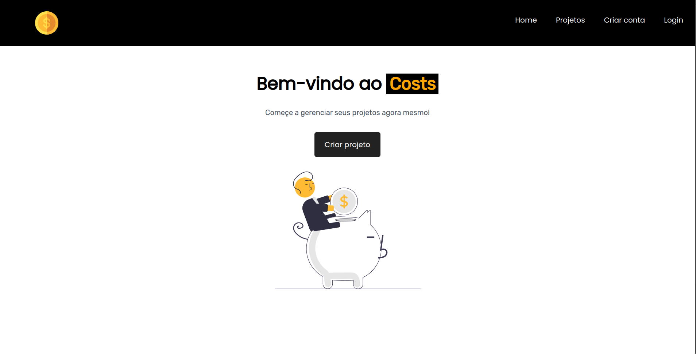
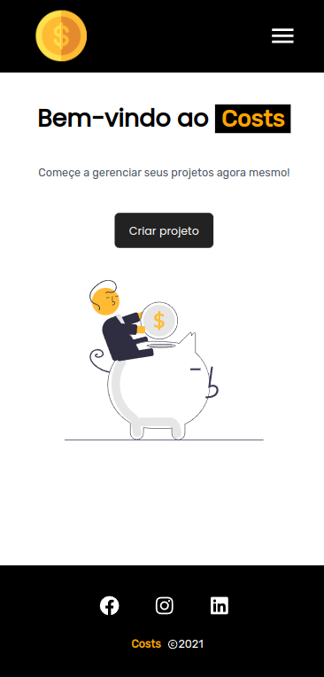

# Costs

Esse projeto foi realizado como desafio da aula 17 do [Curso de React]([https://www.youtube.com/watch?v=KNk0Cex3zcM&list=PLnDvRpP8BneysKU8KivhnrVaKpILD3gZ6&index=52](https://youtube.com/playlist?list=PLnDvRpP8BneyVA0SZ2okm-QBojomniQVO&si=2jzU5asvtNHiEc9c)) do canal Matheus Battisti - Hora de Codar.

O projeto servia de base para fixar os conteúdos aprendidos durante o curso.

## O Desafio

O projeto consiste em um sistema onde o usuário cria um projeto com seu orçamento e pode alocar parte desse orçamento a tarefas.

Nesse desafio foi recebido o layout do projeto bem como suas funcionalidades que deveriam ser implementadas. Entre as funcionalidades tínhamos a inserção de um projeto, a exclusão deste, a atualização do mesmo podendo-se alocar recursos dentro do orçamento, o que se subtria dentro do valor cheio definido para o projeto.

Dentro do projeto também foi criado uma página de login, feito a integração com o Firebase Authentication, bem como implementado a funcionalidade de salvar os projetos em sua conta. Como banco de dados foi usado o Firebase Firestore, que trabalha com um banco de dados não relacional. 

Este projeto foi um grande desafio para mim e me fez avançar muito nos estudos de React, já que além das aulas do curso foi necessário estaudar a documentação da tecnologia bem como se aprofundar com a ajuda de pesquisas na internet.

Além disso, este projeto foi meu primeiro contato com o uso de bancos de dados. Sendo assim, foi um projeto onde pude me desenvolver e consolidar conhecimentos importantes.

## Conheça o projeto

[Acesse o projeto no ar aqui](https://costs-coral.vercel.app/)

[Acesse o código aqui](https://github.com/thiagoomatheus/costs/tree/main)

## Tecnologias/Conhecimentos Utilizados

- HTML5 Semântico
- Tailwind CSS
- Typescript
- React 18
  - Props
  - Context API
  - Custom Hoooks
- SPA
- Firebase Authentication
- Firebase Firestore

## Autor

- [thiagoomatheus](https://github.com/thiagoomatheus)
